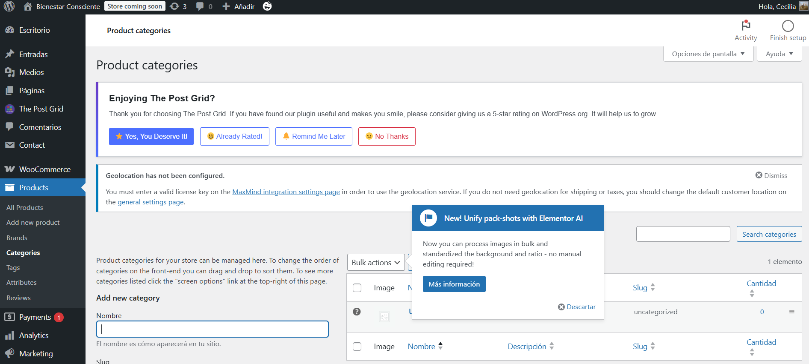

# Productos en WooCommerce

## Tipos de Productos 
WooCommerce nos da la posibilidad de crear 4 tipos de productos en nuestra tienda on-line:
- Productos simples
- Productos agrupados
- Productos externos o afiliados
- Productos variables

## Productos agrupados
Es la suma de varios productos, pero que se comportan como uno solo. 

## Producto simple
Cubren la mayoria de los productos que se venden, ya que hacen referencia a productos simples que no tienen opciones o variaciones. Son ideales para artículos únicos como libros, sillas, entradas o cursos. Pasos para crear un producto simple:
- Crear la categoria: 

- Ir a Productos > **Añadir nuevo**.
    - **Título y descripción**: Ingresar un nombre claro (ejemplo: Silla de madera) y una descripción detallada.
    - **Tipo de producto**: Seleccionar "Producto simple" en el menú desplegable.
    - **Precio**: Ingresar el precio del producto. Opcional: agregar un precio de oferta.
    - **Inventario**: Establecer código SKU y estado de stock (si se desea gestionar inventario).
    - **Imagen destacada**: Subir una foto principal del producto.
    - **Categoría**: Crear o asignar una categoría existente (ejemplo: Muebles).
    - **Publicar**: Hacer clic en "Publicar" para que el producto quede disponible en la tienda.

## Producto variable
Este tipo de producto permite ofrecer diferentes versiones de un mismo ítem, como talles o colores.
- **Ejemplo**: Remera con variaciones en color (rojo, azul, verde) y tamaño (S, M, L).
- Pasos para crear un producto variable:
    - Ir a Productos > **Añadir nuevo**.
        - **Título y descripción**: Ingresar nombre y detalles generales del producto (ejemplo: Remera básica unisex).
        - **Tipo de producto**: Seleccionar "Producto variable".
        - **Atributos**:
            - Ir a la pestaña "Atributos".
            - Crear un atributo (por ejemplo, Color) y agregar valores separados por `|`: Rojo | Azul | Verde.
            - Marcar la opción "Usado para variaciones" y guardar.
        - **Variaciones**:
            - Ir a la pestaña "Variaciones".
            - Crear una nueva por cada combinación (por ejemplo: Color Rojo).
            - Asignar precio, imagen específica y, si se desea, peso o dimensiones.
        - **Imagen destacada**: Opcional si ya hay imágenes en las variaciones.
        - **Categoría**: Asignar categoría (ejemplo: Indumentaria).
        - **Publicar**: Hacer clic en "Publicar" para hacer visible el producto.

> Este enfoque permite una experiencia de compra más dinámica y personalizada para el cliente.