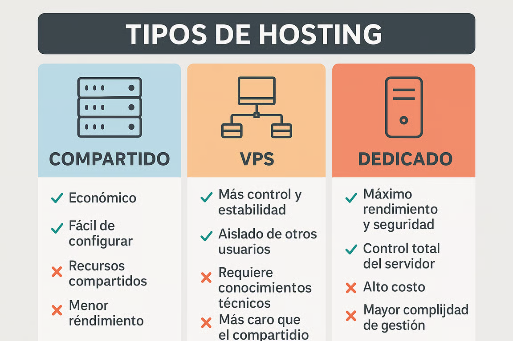

# Preparación del servidor y configuración de dominio
- 🌐 **¿Qué es un dominio?**
    - Un dominio es el nombre único que se le da a un sitio web para que las personas puedan acceder fácilmente. 
    - Por ejemplo: tusitio.com. Es mucho más sencillo de recordar que una dirección IP numérica.
- 🧭 **¿Qué es el DNS?**
    - El DNS (Domain Name System) es el sistema que traduce el dominio que escribís en el navegador (como www.tusitio.com) en la dirección IP real del servidor donde está alojado tu sitio. Es como la guía telefónica de Internet.

## Tipos de Hosting

## Configurar dominio y servidor paso a paso
- Registrar un dominio, contratar un hosting y configurar los DNS 🌐
- A continuación, te explicamos paso a paso cómo registrar un dominio, contratar un servicio de hosting y asignar correctamente los DNS para vincular ambos elementos. Además, aprenderás a ingresar al **Cpanel** y verificar que todo esté correctamente configurado 🛠️.
    - **Registro de un dominio gratuito** 🆓
        - Podés registrar un dominio gratuito en Freenom:
        - Ingresá a Freenom y buscá el nombre de dominio que desees (por ejemplo: mitienda.tk).
        - Si está disponible, hacé clic en "Get Now" y luego en "Checkout".
        - Completá el registro (no uses redes sociales para crear tu cuenta).
        - Confirmá tu cuenta a través del email que recibirás 📩.
    - **Contratar un hosting** (Neolo como ejemplo) 💻
        - Ingresá a Neolo y seleccioná tu país 🌎.
        - Elegí un plan (preferentemente de 12 meses para mayor estabilidad).
        - Durante la contratación, ingresá el dominio que registraste previamente en Freenom.
        - Finalizá la compra y revisá tu email: te llegarán los datos de acceso al hosting y los DNS necesarios 🔑.
    - **Asignar DNS al dominio** 🔄
        - Ingresá al área de cliente en Freenom, accedé a "`Mis dominios`" y luego a "`Management Tools` > `Nameservers`".
        - Seleccioná la opción “Use custom nameservers” e ingresá los DNS que te proporcionó Neolo por correo.
        - Guardá los cambios 💾.
    - **Verificar configuración en el Cpanel** ✔️
        - Ingresá al área de clientes de Neolo.
        - Accedé al **Cpanel** utilizando los datos enviados por email.
        - Desde allí, podés:
            - Verificar que el dominio esté correctamente vinculado.
            - Crear tu sitio web o instalar WordPress usando Softaculous.
            - Administrar archivos, bases de datos y correo electrónico, entre otras opciones 📂.